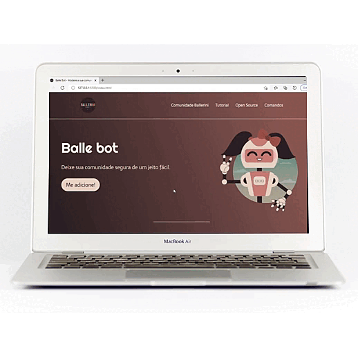
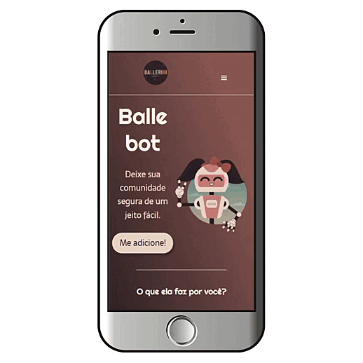

# Landing Page - Balle Bot

[Preview](https://github.com/PatriciaRodriguesR/LandingPage-BalleBot#eye_speech_bubble-preview) • [Description](https://github.com/PatriciaRodriguesR/LandingPage-BalleBot#information_source-about) • [Technologies](https://github.com/PatriciaRodriguesR/LandingPage-BalleBot#hammer_and_wrench-technologies) • [Tasks](https://github.com/PatriciaRodriguesR/LandingPage-BalleBot#memo-tasks) • [License](https://github.com/PatriciaRodriguesR/LandingPage-BalleBot#page_with_curl-license) • [View Demo](https://PatriciaRodriguesR.github.io/LandingPage-BalleBot/)

 

------

## 👁️‍🗨️ **Preview**

Check out how it looks: [View Demo](https://PatriciaRodriguesR.github.io/LandingPage-BalleBot/)

### 🖥️ Computer

------

### 📱 Mobile

------

## ℹ️ Description

A Landing Page made based on tutorial online, hosted by [Rafaella Ballerini](https://www.youtube.com/watch?v=llF6vD-RljE).

------

## 🛠️ **Technologies**

 

------

## 📝 **Tasks**

- [x] Add favicon
- [x] Responsive Layout
- [x] Add icons
- [x] Create ReadME
- [x] Create license

------

## 📃 License

This project is under the **MIT license**. See the [LICENSE](https://github.com/PatriciaRodriguesR/LandingPage-BalleBot/blob/master/LICENSE) for more information.

------

Made with 💜 by [**Patrícia Rodrigues**](https://github.com/PatriciaRodriguesR/) 👋
